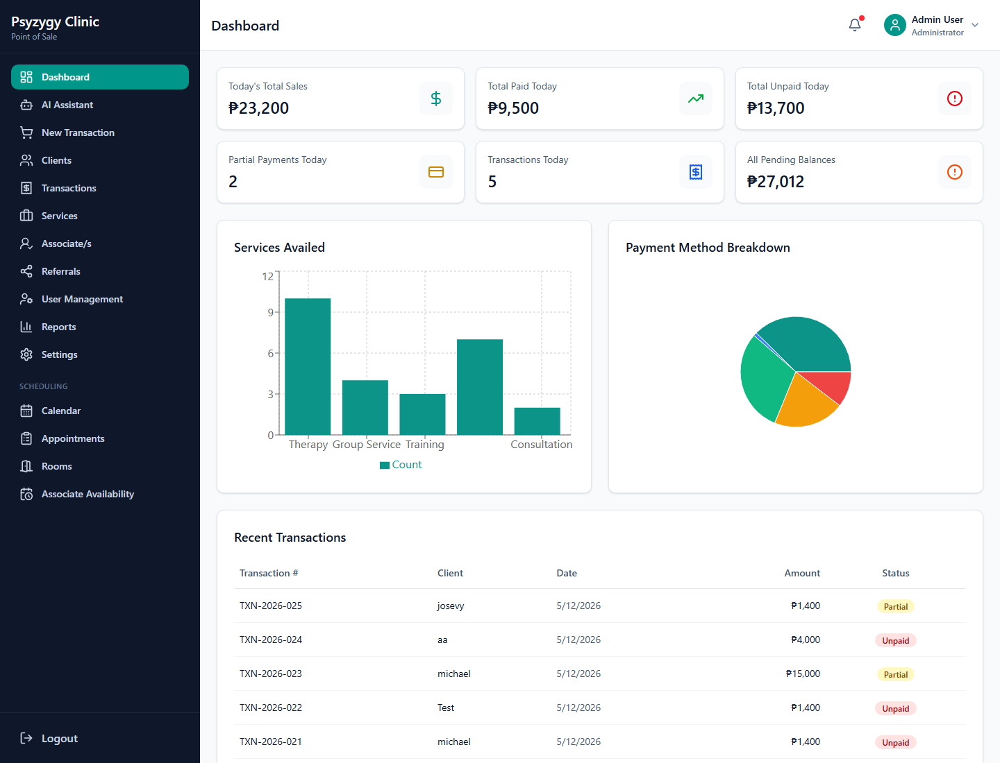
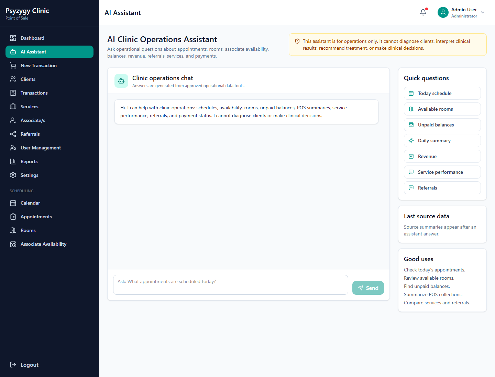
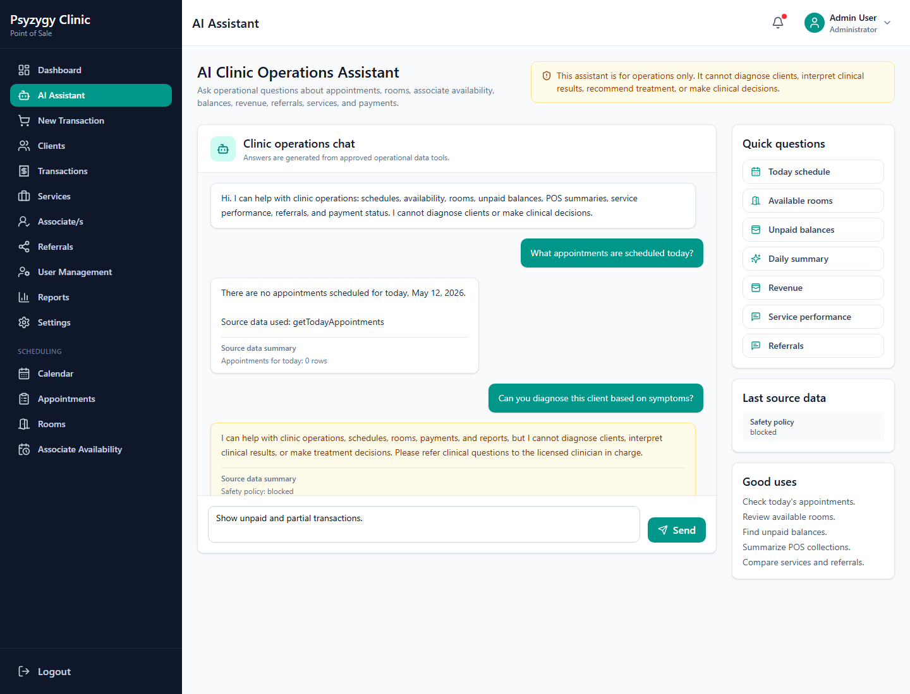
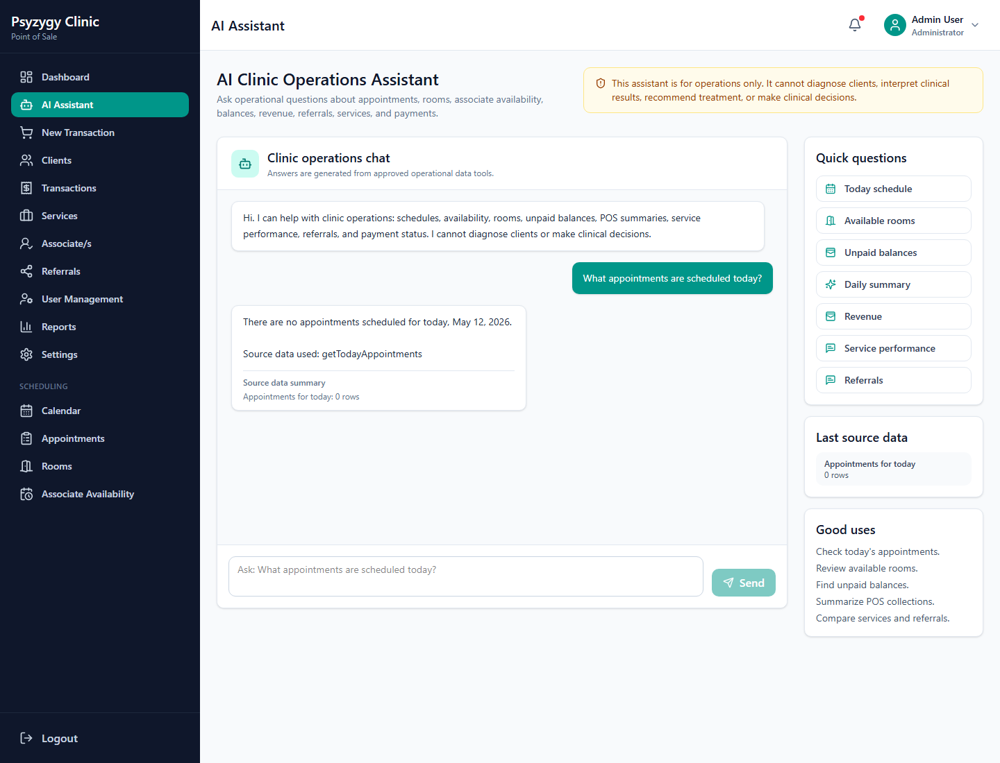
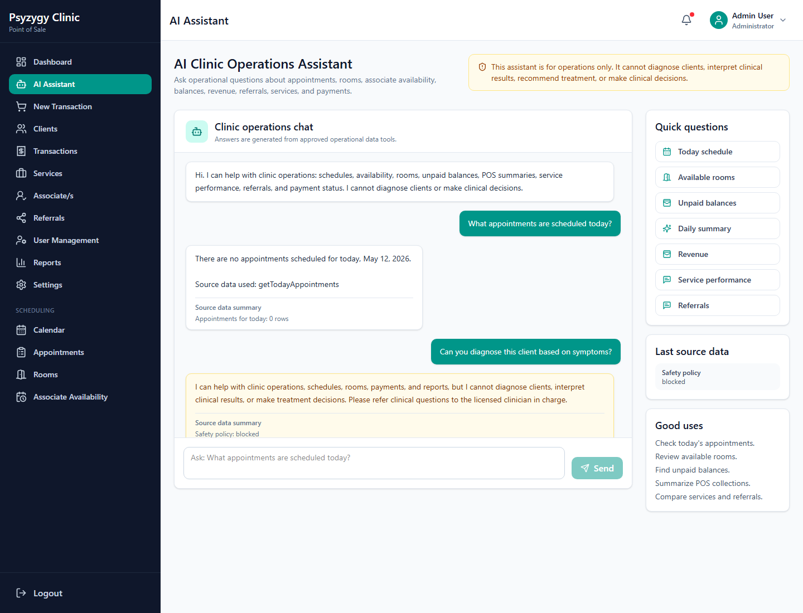

# AI Clinic Operations Assistant User Manual

This guide is for front desk staff, managers, and administrators who use the AI Clinic Operations Assistant in the Psyzygy Psychological Center POS system.

The assistant helps with clinic operations such as schedules, rooms, associates, payments, revenue summaries, service performance, and referral summaries. It does not provide clinical advice, diagnoses, treatment recommendations, or psychological interpretation.

## 1. What The AI Assistant Can Help With

Use the AI Assistant for operational questions such as:

- Today's appointments and schedule summaries
- Associate availability
- Room availability
- Unpaid or partially paid transactions
- Daily, weekly, monthly, or yearly revenue summaries
- Service performance summaries
- Referral source summaries
- Transaction and payment status

Do not use the assistant for:

- Diagnosing a client
- Interpreting psychological test results
- Choosing a treatment plan
- Recommending therapy or medication
- Making clinical decisions
- Handling emergency or crisis instructions

If a question is clinical, the assistant will refuse and remind staff to refer the concern to the licensed clinician in charge.

## 2. Opening The AI Assistant

1. Log in to the POS system using your assigned account.
2. In the left sidebar, find **AI Assistant**.
3. Click **AI Assistant** to open the chat page.

## 3. AI Assistant Page Overview

The AI Assistant page has three main areas:

- **Quick questions** for common clinic tasks.
- **Chat area** where questions and answers appear.
- **Question box** where staff can type a custom question.

The page also shows a reminder that the assistant is for clinic operations only.

## 4. Using Quick Questions

Quick questions are buttons for common front desk and admin requests.

Examples include:

- "What appointments do we have today?"
- "Show unpaid balances."
- "Give me today's clinic summary."
- "Which rooms are available?"
- "Show service performance."

To use a quick question:

1. Open **AI Assistant**.
2. Click one of the quick question buttons.
3. Wait for the answer to appear in the chat area.
4. Review the answer and the source data summary.

Quick questions are useful when staff needs a fast summary without typing a full request.

## 5. Asking A Custom Question

Staff can type their own operational question in the message box.

Good examples:

- "What are the unpaid transactions today?"
- "Show revenue summary for this month."
- "Which associates are available tomorrow?"
- "Are there available rooms today from 2pm to 3pm?"
- "What services performed best this week?"
- "Show referral source summary for this month."

To ask a custom question:

1. Click the message box at the bottom of the AI Assistant page.
2. Type the question in simple language.
3. Click **Send**.
4. Read the assistant's answer.
5. Check the source data summary when available.

## 6. Reading The Answer

The assistant answers in simple front desk and admin language. When possible, it also includes a **Source Data Summary**.

The source summary helps staff see what data was checked, such as:

- Appointments
- Room availability
- Associate availability
- Unpaid transactions
- Revenue summary
- Referral summary
- Service performance

Always use the source summary to confirm whether the assistant used current operational data.

## 7. Common Workflow: Today’s Appointments

Use this when staff wants to prepare the front desk schedule for the day.

Suggested questions:

- "What appointments do we have today?"
- "Show today's schedule."
- "Give me today's appointment summary."

The assistant may return:

- Number of appointments
- Appointment times
- Client names if available
- Service names
- Associate names
- Room names
- Appointment status
- Payment status

Staff should still open the Scheduling Calendar or Appointments page for detailed actions such as editing, confirming, cancelling, or converting an appointment to a POS transaction.

## 8. Common Workflow: Room Availability

Use this when staff needs to know which room can be used for an appointment.

Suggested questions:

- "Which rooms are available today?"
- "Are there available rooms tomorrow at 10am?"
- "What rooms are free from 2pm to 3pm today?"

The assistant checks approved room availability data and summarizes open rooms. If no time is provided, it may provide a general availability response based on the data available.

For final booking, staff should still create or update the appointment in the Scheduling module.

## 9. Common Workflow: Associate Availability

Use this when staff needs to know which associate may be available for scheduling.

Suggested questions:

- "Which associates are available today?"
- "Show associate availability tomorrow."
- "Who is available this week?"

The assistant uses associate availability records and appointment data when available. Staff should still confirm the final schedule in the Appointment Create/Edit page.

## 10. Common Workflow: Unpaid Balances

Use this when staff needs to follow up on unpaid or partially paid transactions.

Suggested questions:

- "Show unpaid transactions."
- "Who has outstanding balances?"
- "Show partial payments."
- "What transactions still need payment?"

The assistant may summarize:

- Transaction number
- Client name if available
- Total amount
- Total paid
- Balance
- Payment status

Staff should open the Transactions or POS payment page to record actual payments.

## 11. Common Workflow: Revenue Summary

Use this for quick operational reporting.

Suggested questions:

- "Give me today's revenue summary."
- "Show revenue summary for this week."
- "Show revenue summary for this month."
- "How much did we collect today?"

The assistant may summarize:

- Gross sales
- Payments collected
- Outstanding balance
- Transaction count
- Date range used

For official reporting, use the Reports section and exported reports from the POS system.

## 12. Common Workflow: Service Performance

Use this to understand which services were most used or generated the most revenue.

Suggested questions:

- "Show service performance this month."
- "What are the top services this week?"
- "Which services had the highest revenue?"

The assistant may summarize:

- Service name
- Quantity or count
- Sales amount
- Date range used

Use this for quick operational insight. For official records, use the Reports page.

## 13. Common Workflow: Referral Source Summary

Use this when staff or management wants to know where clients or sales are coming from.

Suggested questions:

- "Show referral summary this month."
- "Which referral sources performed best?"
- "Show referral source summary for this week."

The assistant may summarize referral names, transaction counts, or revenue based on available records.

## 14. Clinical Safety Rules

The assistant is intentionally limited to clinic operations.

If staff asks a clinical or diagnostic question, the assistant will block the request and respond with a safety reminder.

Examples of blocked questions:

- "What diagnosis does this client have?"
- "What treatment should we recommend?"
- "Can you interpret this assessment result?"
- "What medication should the client take?"

When this happens:

1. Do not try to reword the same clinical question.
2. Refer the concern to the assigned licensed clinician.
3. Follow clinic policy for urgent or sensitive concerns.

## 15. Privacy And Proper Use

Use the assistant only for authorized clinic operations.

Staff should:

- Ask only work-related questions.
- Avoid entering unnecessary sensitive details.
- Use client names only when needed for legitimate clinic work.
- Confirm important information in the actual POS pages.
- Remember that the assistant summarizes data; it does not replace official records.

The assistant records usage logs for accountability.

## 16. Source Data Summary

When the assistant answers, it may show a source data summary below the response.

This section can show:

- Which approved data tools were checked
- How many rows were found
- Whether a query returned an error
- The date range interpreted by the assistant

If the answer seems incomplete, check the source data summary first. It may show that there was no matching data for the selected date or request.

## 17. Troubleshooting

### AI Assistant is not visible in the sidebar

Possible reasons:

- The logged-in user role does not have access.
- The app version in the browser is outdated.
- The user account is inactive.

What to do:

1. Log out and log back in.
2. Ask an admin to verify the user account role and active status.
3. Refresh the browser.

### The assistant says you are not allowed to use it

The account may not have the required access role.

Ask an administrator to check:

- User role
- Active status
- Supabase user profile mapping

### The assistant returns no data

Possible reasons:

- There are no matching appointments, transactions, services, or referrals.
- The question used a date range with no records.
- The data has not yet been entered in the POS system.

Try asking with a clearer date range, such as:

- "Show appointments today."
- "Show revenue summary for this month."
- "Show unpaid transactions."

### Edge Function request fails

If the assistant cannot send a request to the Edge Function, the AI backend may not be deployed or configured correctly.

Ask the technical administrator to check:

- Supabase Edge Function deployment
- Function name: `ai-clinic-assistant`
- Supabase project URL and anon key
- User session token
- CORS settings

### OpenAI quota or billing error

If the assistant says OpenAI quota is unavailable, the connection is working but the OpenAI project needs billing or quota attention.

Ask the OpenAI account owner to check:

- Billing status
- Available credits
- Usage limits
- Correct `OPENAI_API_KEY` Supabase secret

After quota is restored, try the question again.

## 18. Good Prompt Examples

Use clear and specific questions.

Examples:

- "What appointments do we have today?"
- "Show unpaid transactions."
- "Give me today's clinic summary."
- "Which rooms are available today from 1pm to 2pm?"
- "Show associate availability tomorrow."
- "Show revenue summary for this month."
- "Show referral summary this week."
- "What services performed best this month?"
- "Show transaction payment status summary."

Avoid vague questions such as:

- "What happened?"
- "How are we doing?"
- "Tell me everything."

Better versions:

- "Give me today's clinic summary."
- "Show this week's revenue summary."
- "Show unpaid balances."

## 19. Front Desk Checklist

At the start of the day:

1. Ask: "What appointments do we have today?"
2. Ask: "Which rooms are available today?"
3. Ask: "Show unpaid transactions."
4. Review the Scheduling Calendar for details.

During the day:

1. Ask room or associate availability questions before booking.
2. Check unpaid balances before payment follow-up.
3. Confirm final appointment and payment actions in the main POS pages.

At closing:

1. Ask: "Give me today's clinic summary."
2. Ask: "Show today's revenue summary."
3. Ask: "Show unpaid transactions."
4. Export official reports from the Reports page when needed.

## 20. Key Reminder

The AI Clinic Operations Assistant is a helper for administrative work. It summarizes approved clinic operations data, but staff should always use the main POS pages for official actions, records, payments, scheduling changes, and reports.
