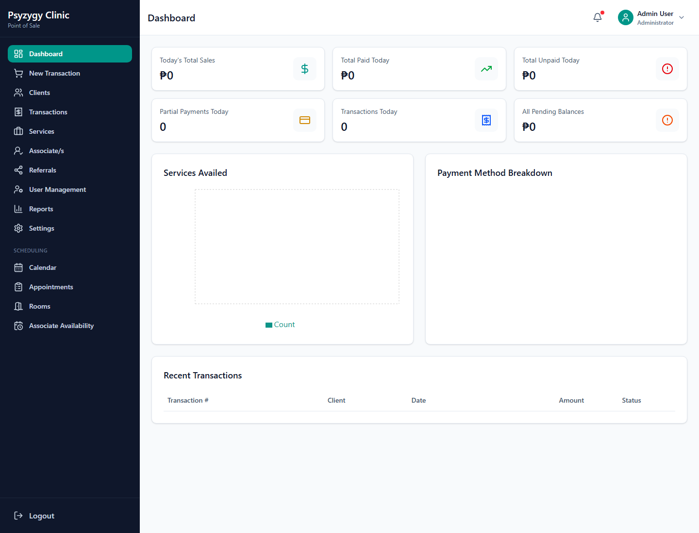
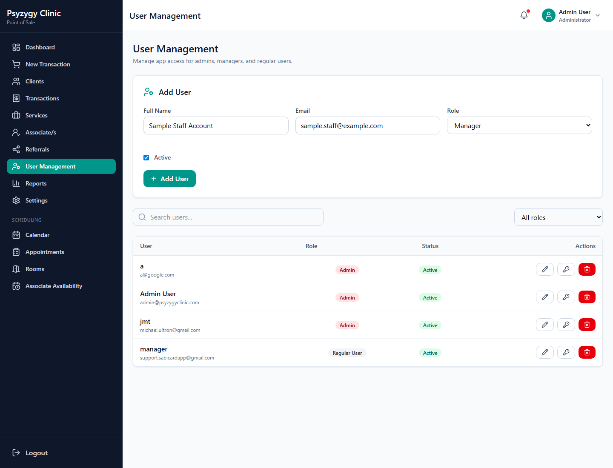
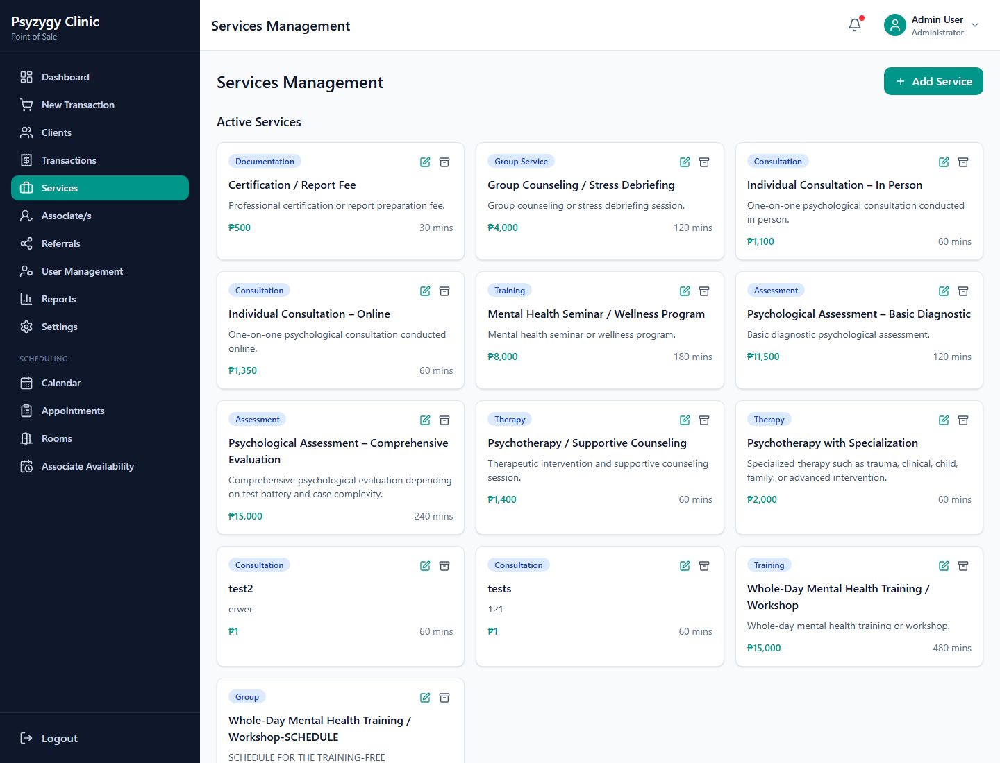
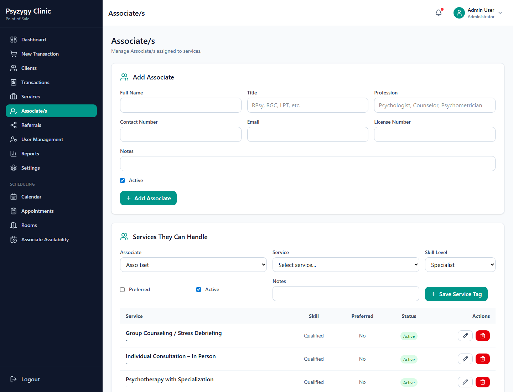
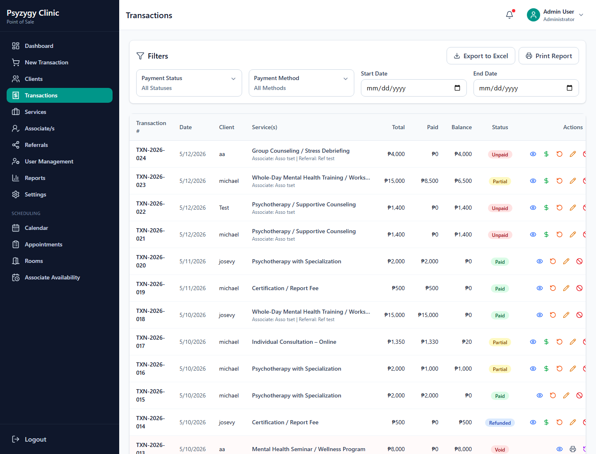
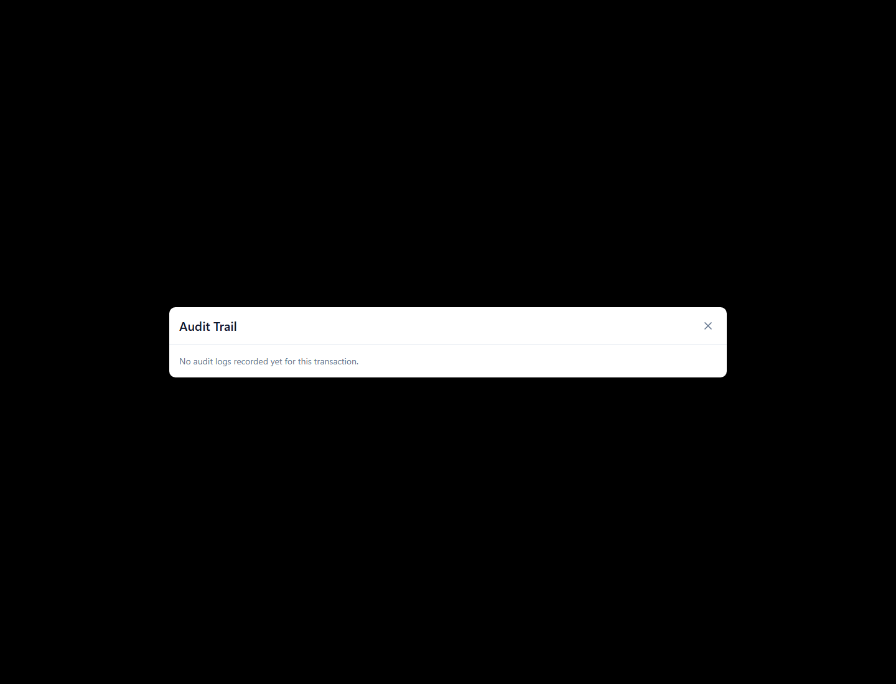
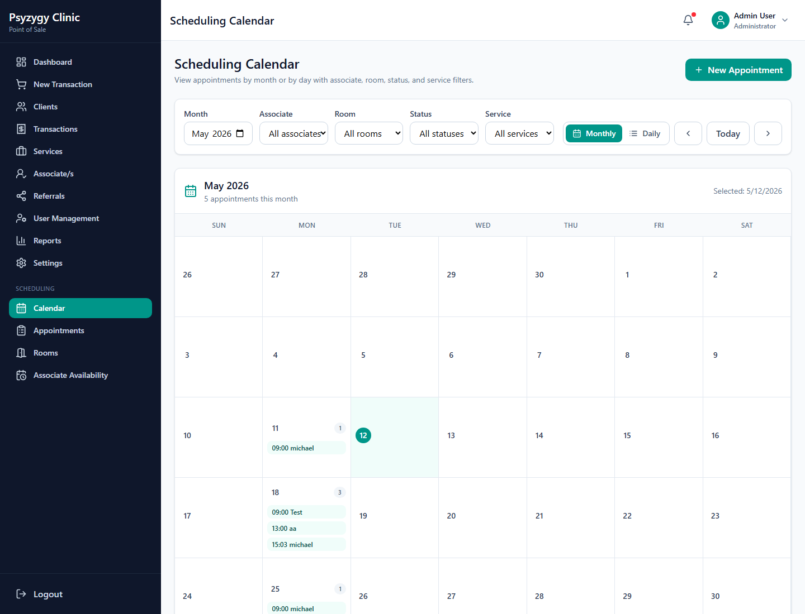
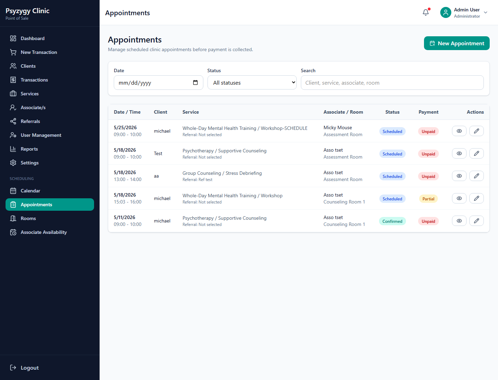

# Psyzygy Clinic POS Admin Operations Manual

Administrator guide for Psyzygy Psychological Center.

This manual is for users with admin access. It focuses on configuration, account management, service setup, scheduling setup, tax settings, transaction controls, and operational safeguards.

## Table of Contents

1. [Admin Responsibilities](#admin-responsibilities)
2. [Admin Dashboard](#admin-dashboard)
3. [User Management](#user-management)
4. [Clinic, Receipt, and Logo Settings](#clinic-receipt-and-logo-settings)
5. [Philippine Tax Configuration](#philippine-tax-configuration)
6. [Payment Methods](#payment-methods)
7. [Discount Types](#discount-types)
8. [Services Management](#services-management)
9. [Associate/s and Service Tags](#associates-and-service-tags)
10. [Rooms Management](#rooms-management)
11. [Associate Availability](#associate-availability)
12. [Transaction Administration](#transaction-administration)
13. [Audit Trail](#audit-trail)
14. [Reports and Reconciliation](#reports-and-reconciliation)
15. [Scheduling Administration](#scheduling-administration)
16. [Admin Safety Checklist](#admin-safety-checklist)

## Admin Responsibilities

Admins maintain the setup that front desk staff use every day.

Admin responsibilities include:

1. Creating and managing user accounts.
2. Assigning correct user roles.
3. Maintaining clinic profile and receipt details.
4. Configuring VAT or NON-VAT settings.
5. Managing payment methods and discount types.
6. Maintaining services, prices, and service duration.
7. Maintaining Associate/s and the services they can handle.
8. Maintaining room records and associate availability.
9. Reviewing transaction edits, voids, refunds, and audit trails.
10. Reviewing reports for end-of-day or management reconciliation.

Important:

- Admin changes affect the whole system.
- Do not change tax, receipt, or discount settings unless approved by clinic management.
- Prefer deactivating records over deleting records when the record may already be linked to transactions or appointments.

## Admin Dashboard

Use the dashboard to monitor clinic activity after signing in.

Admin checks:

1. Review daily transaction activity.
2. Check payment status and balances.
3. Review whether appointments and POS workflows are operating normally.
4. Use the sidebar to access settings, users, reports, and scheduling administration.

## User Management

Only admins should manage users.

### Add a User

Steps:

1. Go to **User Management**.
2. Enter the staff member's **Full Name**.
3. Enter the staff member's **Email**.
4. Select the correct **Role**.
5. Keep **Active** checked if the account should be usable immediately.
6. Click **Add User**.
7. The system sends a password reset email so the user can set their password.

Role guide:

- **Admin** can manage users, settings, services, transactions, scheduling, reports, and configuration.
- **Manager** can operate clinic workflows and scheduling but should not manage admin-only configuration unless permitted by policy.
- **Regular User** is for day-to-day front desk operations.

### Edit a User

Steps:

1. Find the user in the list.
2. Click the edit button.
3. Update the name, role, or active status.
4. Click **Update User**.

### Reset a User Password

Steps:

1. Find the user in the list.
2. Click the key or reset password action.
3. Confirm that the password reset email is sent.
4. Ask the user to check their email and set a new password.

### Deactivate a User

Use deactivation when a staff member should no longer access the system.

Steps:

1. Edit the user.
2. Uncheck **Active**.
3. Save the user.

Best practice:

- Deactivate accounts instead of deleting them when the account may be connected to audit history or operational records.

## Clinic, Receipt, and Logo Settings

Use **Settings** to manage clinic identity and receipt display.

Clinic profile fields:

1. Clinic name.
2. Contact number.
3. Email.
4. Website.
5. Address.
6. Clinic logo.

Receipt settings:

1. Enable or disable the clinic logo on receipts.
2. Enable or disable terms and conditions.
3. Update the receipt footer note.

Important:

- The logo appears on the login screen and receipts when enabled.
- The receipt footer should be approved wording because it appears on printed receipts.

## Philippine Tax Configuration

Tax settings control how POS totals and receipts are calculated.

Fields:

1. **Enable tax handling** turns tax calculations on or off.
2. **VAT inclusive pricing** controls whether listed prices already include VAT.
3. **Tax Type** can be VAT, NON_VAT, or NONE.
4. **Tax Rate (%)** is usually 12 for Philippine VAT.
5. **BIR registered** indicates registration status.
6. **TIN Number** appears on receipts when provided.

VAT mode:

- Use **VAT** only when the clinic is VAT-registered.
- VAT is normally 12%.
- Receipts show VATable sales and VAT amount.

NON-VAT mode:

- Use **NON_VAT** when the clinic is non-VAT registered.
- VAT is not added.
- Receipts display **NON-VAT REGISTERED** and **VAT-EXEMPT SALE**.

Admin rule:

- Confirm tax changes with management or accounting before saving.
- After changing tax settings, test a sample POS calculation before live use.

## Payment Methods

Payment methods appear in the POS payment dropdown and transaction payment dialogs.

Steps to add a payment method:

1. Go to **Settings**.
2. Scroll to **Payment Methods**.
3. Enter the payment method name.
4. Keep **Active** checked if it should be available.
5. Click **Add**.

Common payment methods:

- Cash
- GCash
- Maya
- Bank Transfer
- Credit Card
- Debit Card
- HMO / Company Sponsored
- Check

Best practice:

- Deactivate unused methods instead of deleting them when historical transactions may reference them.

## Discount Types

Discount types are used in POS transactions.

Steps to add a discount:

1. Go to **Settings**.
2. Scroll to **Discount Types**.
3. Enter the discount name.
4. Enter either a percentage or a fixed amount.
5. Keep **Active** checked if front desk staff may use it.
6. Click **Add**.

Examples:

- Senior Citizen Discount
- PWD Discount
- Birthday Discount
- Promotional Discount

Rules:

- Use either percentage or fixed amount clearly.
- Avoid duplicate discount names.
- Deactivate discounts that should no longer be used.

## Services Management

Services are used in POS and scheduling.

Service fields:

1. Name.
2. Category.
3. Description.
4. Default price.
5. Duration in minutes.
6. Active status.

Admin steps:

1. Go to **Services**.
2. Add or edit the service.
3. Confirm the default price.
4. Confirm the duration for scheduling.
5. Keep active services enabled.

Important:

- Service duration affects appointment end time suggestions.
- Default price affects POS and appointment amount due.
- Deactivate services that should no longer be sold or scheduled.

## Associate/s and Service Tags

Use **Associate/s** to manage providers and match them with services.

### Add or Edit an Associate

Steps:

1. Go to **Associate/s**.
2. Enter full name, title, profession, contact number, email, and license number.
3. Add notes if needed.
4. Keep **Active** checked if the associate can be scheduled.
5. Click **Add Associate** or **Update Associate**.

### Services They Can Handle

This section controls scheduling recommendations.

Steps:

1. Select the associate.
2. Select the service.
3. Choose the skill level.
4. Mark **Preferred** when the associate is preferred for that service.
5. Keep **Active** checked.
6. Add notes if needed.
7. Click **Save Service Tag**.

Skill levels:

- **Qualified** means the associate can handle the service.
- **Preferred** means the associate is a better match.
- **Specialist** means the associate is highly suited for the service.

Scheduling uses these tags to recommend associates.

## Rooms Management

Rooms are used for appointment scheduling and conflict checks.

Steps:

1. Go to **Rooms**.
2. Enter room name.
3. Enter room type.
4. Set capacity.
5. Keep **Active** checked if the room can be scheduled.
6. Add notes if needed.
7. Save the room.

Examples:

- Counseling Room 1
- Counseling Room 2
- Assessment Room
- Play Therapy Room
- Online Session

Best practice:

- Use **Online Session** for online appointments when no physical room is needed.
- Deactivate unavailable rooms instead of deleting them.

## Associate Availability

Availability controls whether the scheduler considers an associate available.

Steps:

1. Go to **Associate Availability**.
2. Select the associate.
3. Select the day of week.
4. Enter start time and end time.
5. Save availability.

Rules:

- Availability must have a start time earlier than the end time.
- Add separate entries when an associate has split availability.
- Keep availability active only when it should be used for scheduling.

## Transaction Administration

Admins can review and control transactions from the **Transactions** page.

Admin actions:

1. View transaction details.
2. Add payment to unpaid or partial transactions.
3. Record refunds when approved.
4. Edit or alter transaction details when correction is required.
5. Void a transaction when it should no longer count.
6. Print receipts.
7. Review audit trail.

Refund rules:

- Refunds are recorded as negative payments.
- Enter a clear refund reason.
- Refunds should match clinic approval and accounting policy.

Void rules:

- Voiding is a soft status change.
- Enter a clear void reason.
- Do not delete transaction records.

Edit rules:

- Enter a reason for the edit.
- Avoid editing paid historical transactions unless correction is approved.
- Review audit trail after edits.

## Audit Trail

Audit trail records important actions for accountability.

Audit logs may include:

1. Transaction creation.
2. Payment added.
3. Refund recorded.
4. Transaction edited.
5. Transaction voided.
6. Appointment created or updated.
7. Appointment converted to POS.
8. Tax settings updated.

Admin review steps:

1. Go to **Transactions**.
2. Click the audit trail action.
3. Review action, reason, previous values, new values, and performed by.

Best practice:

- Require clear reasons for refunds, voids, and edits.
- Use audit logs during reconciliation and investigation.

## Reports and Reconciliation

Reports help administrators review clinic sales and operational activity.

Admin report tasks:

1. Select the reporting period.
2. Review daily, weekly, monthly, or yearly reports.
3. Check paid, partial, unpaid, refunded, and voided activity.
4. Review outstanding balances.
5. Export or print reports as needed.

Recommended end-of-day review:

1. Compare collected payments against transaction totals.
2. Review partial and unpaid balances.
3. Review refunds and voids.
4. Confirm receipt totals match transaction totals.
5. Export the report if management requires a copy.

## Scheduling Administration

Admins should monitor scheduling setup and workflow quality.

Calendar admin tasks:

1. Review monthly and daily schedules.
2. Filter by associate, room, status, or service.
3. Confirm rooms are not double-booked.
4. Confirm associates are scheduled within availability.
5. Open appointment details when corrections are needed.

Appointments list admin tasks:

1. Review appointment status.
2. Confirm payment status.
3. Convert appointments to POS transactions when payment is ready.
4. Cancel appointments instead of deleting them.
5. Use clear cancellation or reschedule notes.

Scheduling safeguards:

- Cancelled appointments should not block future schedules.
- Active rooms, services, and associates are required for clean scheduling.
- Associate service tags improve recommendations.

## Admin Safety Checklist

Before changing settings:

1. Confirm the change is approved.
2. Check whether the setting affects receipts, tax, reports, or scheduling.
3. Avoid changing live tax settings during an active transaction period.
4. Capture or note the previous setting when needed.

Before adding users:

1. Confirm the staff member needs access.
2. Assign the least powerful role that allows the staff member to work.
3. Send a password reset email.
4. Deactivate users who leave the clinic.

Before changing services:

1. Confirm the price.
2. Confirm duration.
3. Confirm whether the service should be active.
4. Update associate service tags if scheduling should recommend providers.

Before transaction corrections:

1. Review the original transaction.
2. Confirm the correction reason.
3. Record payment, refund, edit, or void accurately.
4. Review the audit trail.

End of day:

1. Review reports.
2. Review unpaid and partial balances.
3. Review refunds and voids.
4. Confirm no unauthorized setting changes were made.
5. Log out of the admin account.

