# Psyzygy Clinic POS User Manual

Front desk guide for Psyzygy Psychological Center.

This manual explains the daily workflows for logging in, creating POS transactions, scheduling appointments, collecting payments, printing receipts, and managing scheduling records.

## Table of Contents

1. [Login](#login)
2. [Dashboard](#dashboard)
3. [Client Selection](#client-selection)
4. [POS Transaction Workflow](#pos-transaction-workflow)
5. [Transaction History and Receipt Printing](#transaction-history-and-receipt-printing)
6. [Scheduling Appointments](#scheduling-appointments)
7. [Appointment Calendar](#appointment-calendar)
8. [Rooms Management](#rooms-management)
9. [Associate Availability](#associate-availability)
10. [Client Management](#client-management)
11. [Services Management](#services-management)
12. [Associate/s Management](#associates-management)
13. [Referrals](#referrals)
14. [Reports](#reports)
15. [Settings](#settings)
16. [Daily Front Desk Checklist](#daily-front-desk-checklist)

## Login

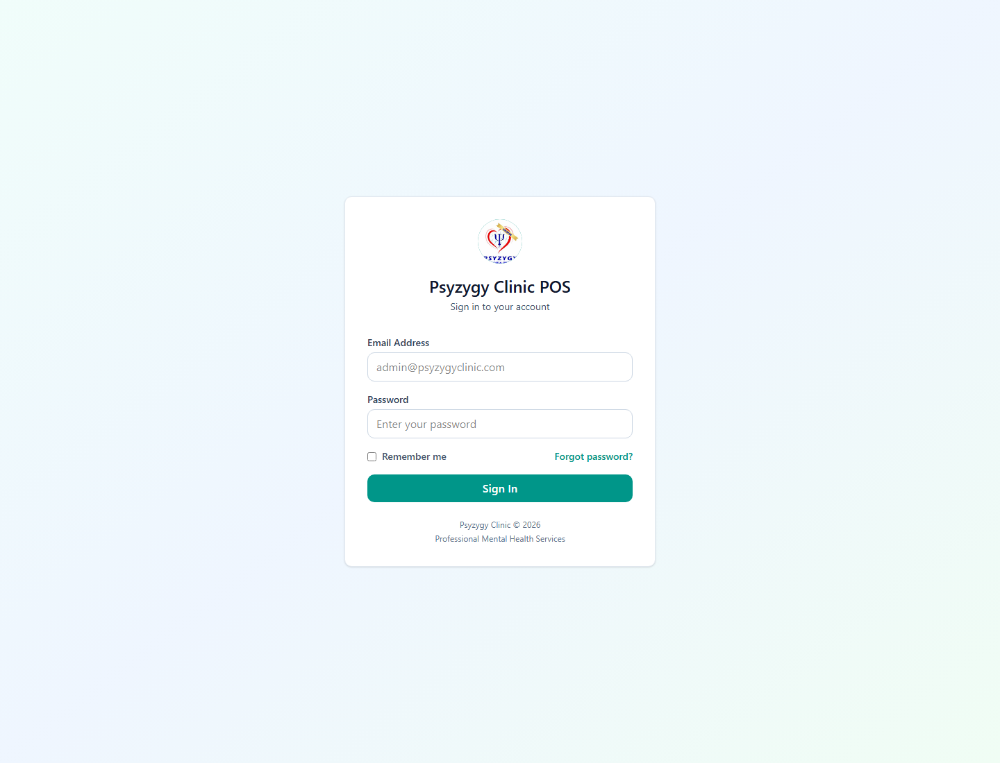

Use the login page to access the system.

Steps:

1. Enter your assigned email address.
2. Enter your password.
3. Click **Sign In**.
4. If you forgot your password, enter your email first, then click **Forgot password?**.

Notes:

- Use only your assigned account.
- Do not share passwords between staff members.
- If login fails, confirm the spelling of the email address and ask an administrator to check whether the user is active.

## Dashboard

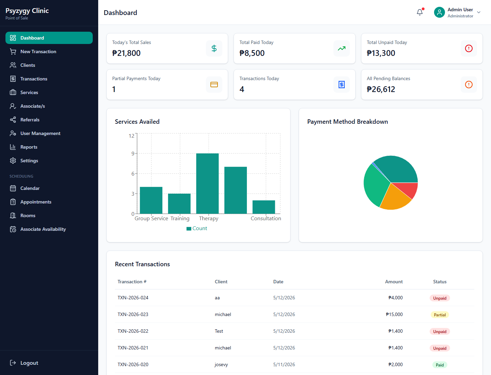

The dashboard is the first page after login. It gives staff a quick view of clinic activity and POS performance.

Use this page to:

1. Check recent sales and payment activity.
2. Review totals and quick metrics.
3. Navigate to POS, transactions, reports, or scheduling from the sidebar.

## Client Selection

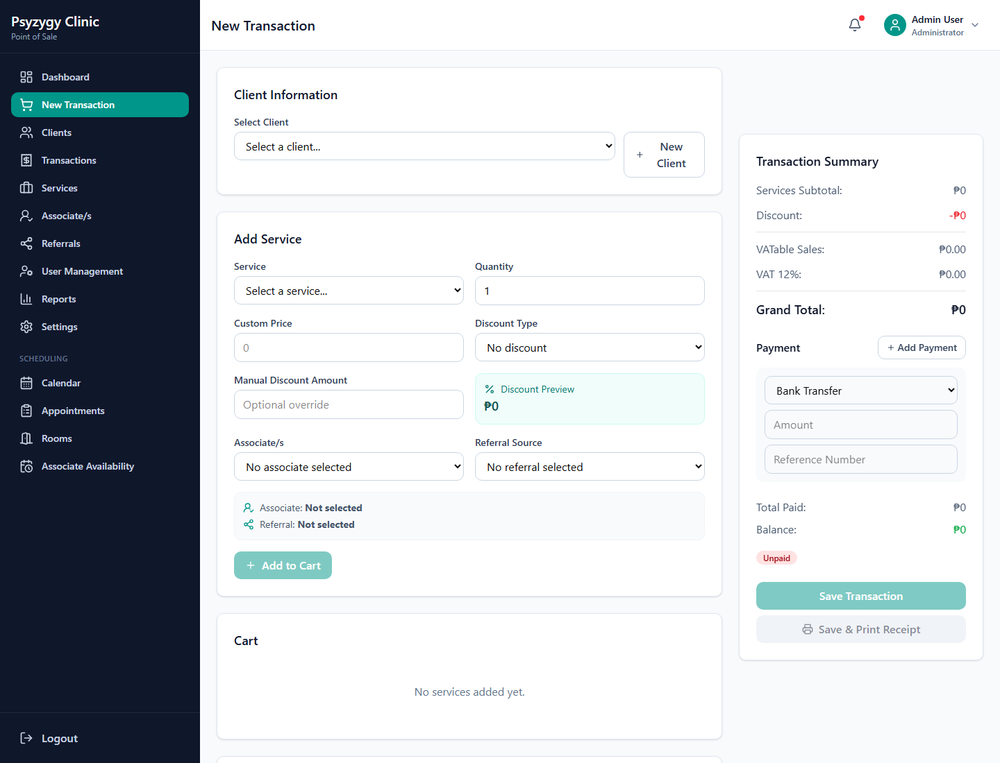

Client selection happens at the start of a POS transaction.

Steps:

1. Click **New Transaction** in the sidebar.
2. Under **Client Information**, open **Select Client**.
3. Choose the client receiving the service.
4. Review the displayed contact, age, and sex information.
5. If the client is new, click **New Client** and enter the client profile before continuing.

Tip:

- Always select the correct client before adding services. Receipts and transaction history are linked to the selected client.

## POS Transaction Workflow

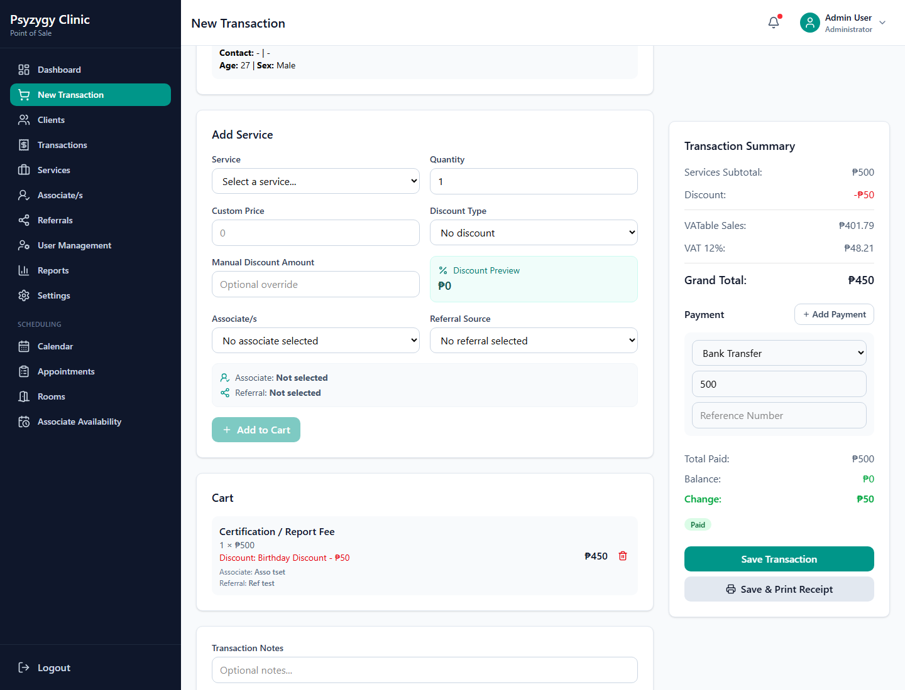

Use **New Transaction** when collecting payment for services.

### Add Service

Steps:

1. In **Add Service**, choose the service from the **Service** dropdown.
2. Confirm the **Quantity**.
3. Enter a **Custom Price** only when the price should differ from the default service price.
4. Select a **Discount Type** if applicable.
5. Enter a **Manual Discount Amount** only when an override is approved.
6. Click **Add to Cart**.

The cart shows:

- Service name
- Quantity and unit price
- Discount applied
- Associate/s
- Referral source
- Line total

### Select Associate

Steps:

1. In the **Associate/s** dropdown, select the associate assigned to the service.
2. Confirm the selected associate appears in the preview area.
3. Add the service to the cart.

Notes:

- Use the associate who actually handled or will handle the service.
- This helps reports and receipts show the correct service provider.

### Select Referral

Steps:

1. In **Referral Source**, select the referral source when applicable.
2. Confirm the referral appears in the preview area.
3. Add the service to the cart.

Use this when the client or service came from a school, company, doctor, organization, or other referral source.

### Apply Discount

Steps:

1. Select the correct discount from **Discount Type**.
2. If needed, enter a manual amount in **Manual Discount Amount**.
3. Review **Discount Preview** before adding the service to the cart.
4. Confirm the discount appears in the cart and transaction summary.

Important:

- Use manual discounts only when authorized.
- Senior Citizen, PWD, and other configured discounts should be selected from the discount dropdown when available.

### VAT/Tax Display

The transaction summary automatically displays tax based on the clinic settings.

If VAT is enabled:

1. The system shows **VATable Sales**.
2. The system shows **VAT 12%** or the configured VAT rate.
3. The **Grand Total** reflects the configured inclusive or exclusive tax mode.

If NON-VAT is enabled:

1. The system shows **NON-VAT REGISTERED**.
2. The system shows **VAT-EXEMPT SALE**.
3. VAT amount remains zero.

Always review the **Grand Total** before collecting payment.

### Partial and Full Payment

Steps:

1. In the **Payment** section, choose the payment method.
2. Enter the amount received.
3. For non-cash methods, enter the reference number if available.
4. Review **Total Paid**, **Balance**, **Change**, and the payment status badge.
5. For partial payments, enter only the amount received.
6. For full payments, enter the full grand total.
7. Click **Save Transaction** or **Save & Print Receipt**.

Payment statuses:

- **Unpaid** means no payment was collected.
- **Partial** means payment was collected but a balance remains.
- **Paid** means the transaction is fully paid.
- **Void** means the transaction was voided and should not be collected.

## Transaction History and Receipt Printing

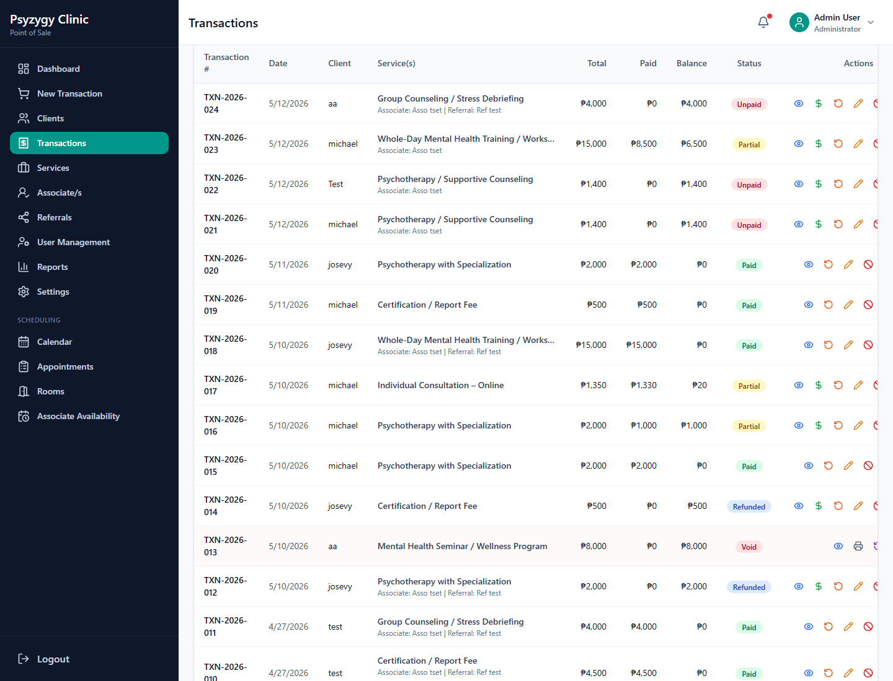

The **Transactions** page lists saved transactions.

Use this page to:

1. Search or filter transactions.
2. Review payment status.
3. Add payment to unpaid or partial transactions.
4. Print receipts.
5. Void transactions when required.
6. Record refunds when approved.
7. Review audit history.

### Print Receipt

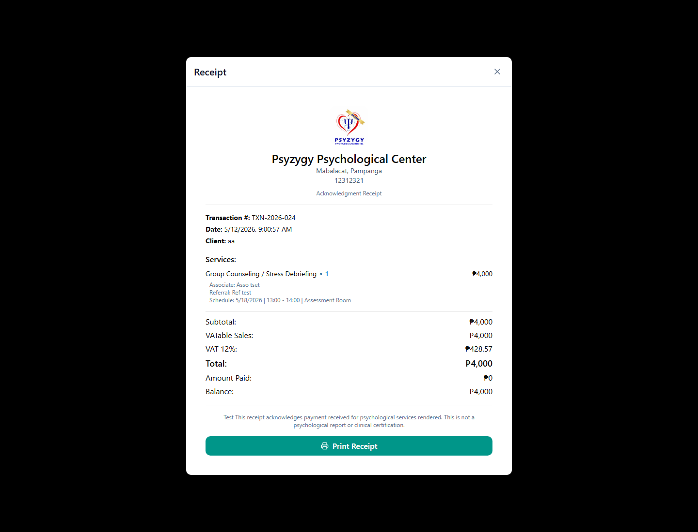

Steps:

1. Go to **Transactions**.
2. Find the transaction.
3. Click the print receipt button.
4. Review the receipt details.
5. Click **Print Receipt**.

Receipt details include:

- Clinic logo and clinic information
- Transaction number and date
- Client name
- Services
- Associate/s
- Referral source
- Schedule, if the service came from an appointment
- VAT or NON-VAT details
- Total, amount paid, and balance
- Receipt footer

For scheduled services, the receipt shows the appointment date, time, and room.

Example:

`Schedule: 5/18/2026 | 13:00 - 14:00 | Assessment Room`

## Scheduling Appointments

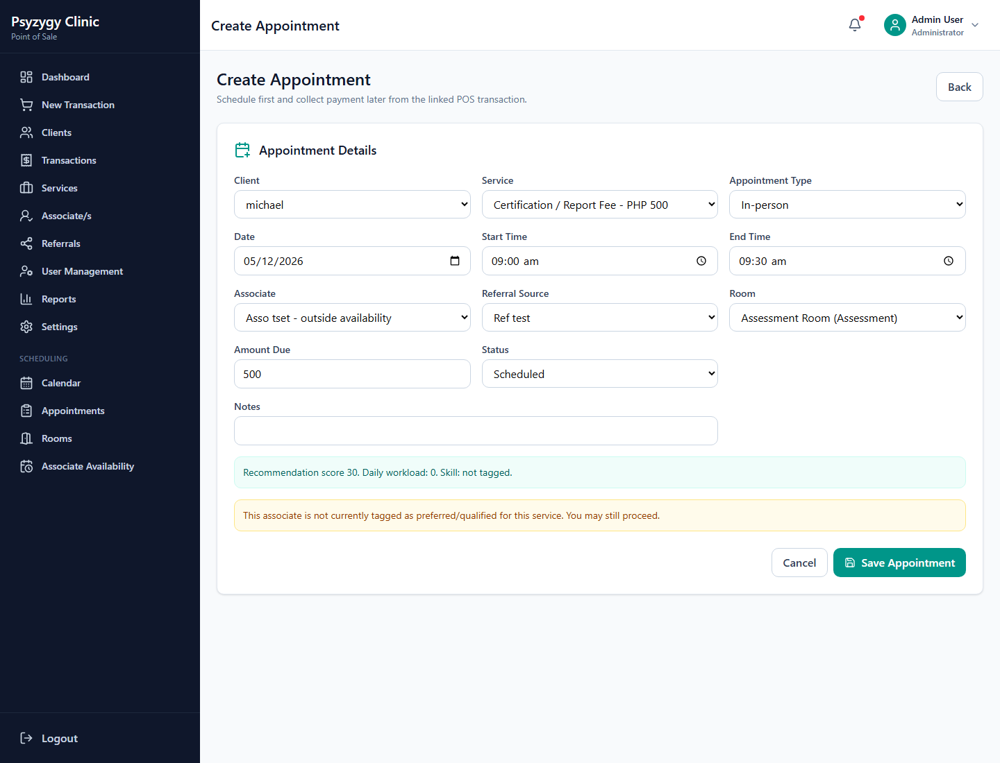

Use scheduling when the clinic needs to book the service first and collect payment later.

Steps:

1. Go to **Calendar** or **Appointments**.
2. Click **New Appointment**.
3. Select the **Client**.
4. Select the **Service**.
5. Choose the **Appointment Type**: In-person, Online, or Hybrid.
6. Select the appointment **Date**.
7. Enter **Start Time** and **End Time**.
8. Select the **Associate**.
9. Select the **Referral Source**, if applicable.
10. Select the **Room** for in-person or hybrid appointments.
11. Confirm the **Amount Due**.
12. Keep the status as **Scheduled** unless the appointment is already confirmed.
13. Add notes when needed.
14. Click **Save Appointment**.

Scheduling checks:

- The associate should be available for the selected date and time.
- The room should not have a conflicting appointment.
- The client should not have another overlapping appointment.
- Inactive services, rooms, or associates should not be used.

If a warning appears, read it before saving. The system may allow staff to continue, but the warning should be reviewed.

### Convert Appointment to POS Transaction

Use this when the client is ready to pay for a scheduled appointment.

Steps:

1. Open **Appointments** or **Calendar**.
2. Open the appointment details.
3. Click **Create POS Transaction**.
4. Go to **Transactions**.
5. Find the created transaction.
6. Click **Add Payment** when the client pays.
7. Print the receipt after payment is recorded.

The appointment and transaction remain linked. Payment status updates based on collected payment.

## Appointment Calendar

The monthly calendar works like a physical clinic calendar.

Use it to:

1. View appointments for the month.
2. Select a specific date.
3. Open appointment details by clicking a scheduled item.
4. Filter by associate, room, status, or service.
5. Create a new appointment.

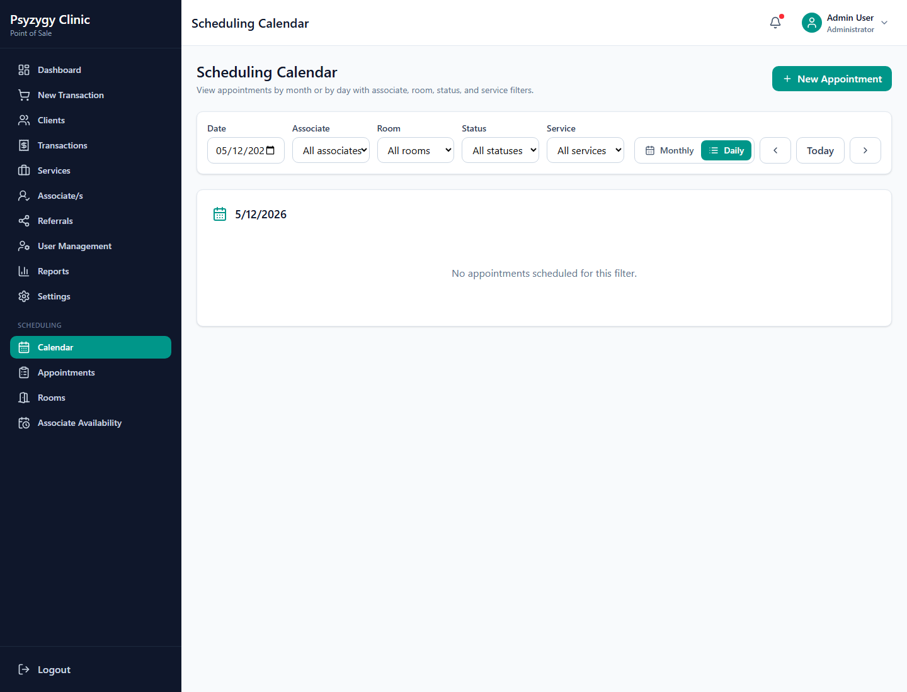

The daily view shows appointments for one date.

Use it to:

1. Review the day schedule.
2. Check appointment status.
3. Check payment status.
4. Open appointment details.
5. Move to previous or next day.

Tip:

- When opening appointment details from the calendar, the **Back** button returns to the same calendar view.

## Rooms Management

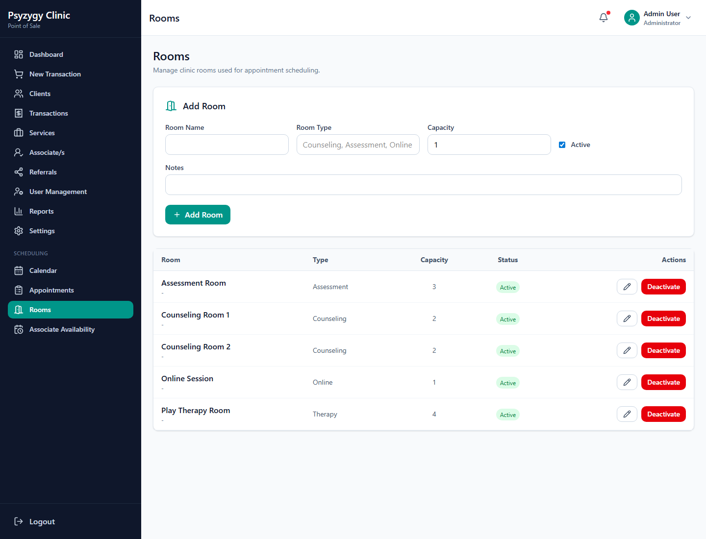

Use **Rooms** to manage clinic rooms and online session room entries.

Steps:

1. Go to **Rooms**.
2. Add or update the room name.
3. Set the room type.
4. Set capacity.
5. Mark the room active or inactive.
6. Add notes if needed.
7. Save the room record.

Notes:

- Inactive rooms should not be selected for new appointments.
- Use **Online Session** for online appointments when a physical room is not needed.

## Associate Availability

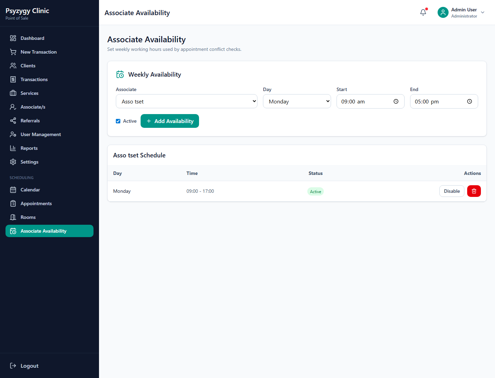

Use **Associate Availability** to define when each associate can be scheduled.

Steps:

1. Go to **Associate Availability**.
2. Select the associate.
3. Select the day of week.
4. Enter start time and end time.
5. Save the availability.

Scheduling uses this availability to recommend associates and warn staff when a selected time is outside availability.

## Client Management

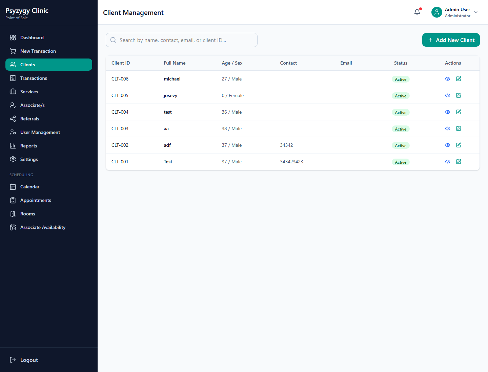

Use **Clients** to manage client profiles.

Common tasks:

1. Add a new client.
2. Update contact information.
3. Review client demographics.
4. Confirm consent and privacy acknowledgement.
5. Search for existing clients before creating a duplicate record.

Best practice:

- Always search first before adding a new client.

## Services Management

Use **Services** to manage clinic service offerings.

Common tasks:

1. Add a service.
2. Set category and description.
3. Set default price.
4. Set duration in minutes.
5. Mark services active or inactive.

Scheduling and POS both use active services.

## Associate/s Management

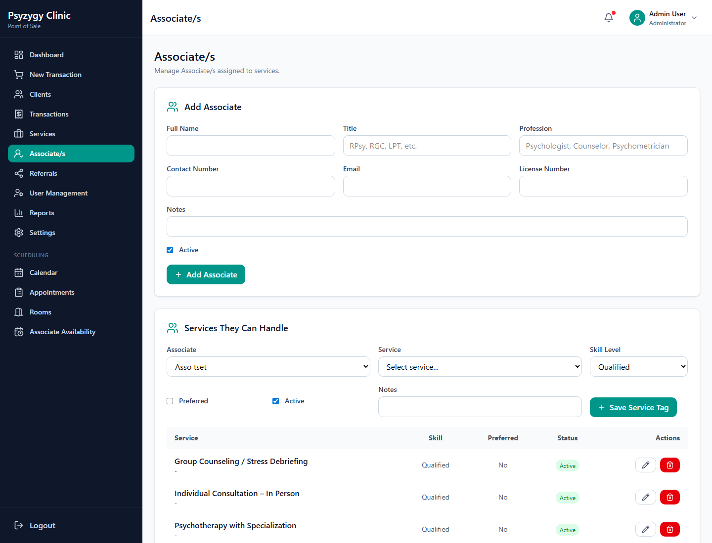

Use **Associate/s** to manage clinic associates.

Common tasks:

1. Add or update associate details.
2. Record professional title and license number.
3. Mark associates active or inactive.
4. Assign services they can handle.
5. Set skill level as Qualified, Preferred, or Specialist.

These service tags help the scheduler recommend the best associate for an appointment.

## Referrals

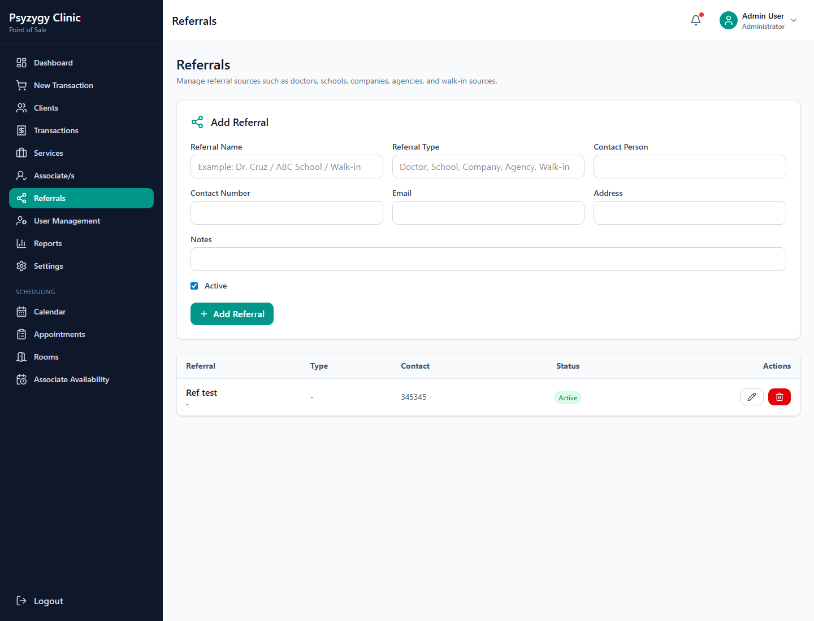

Use **Referrals** to manage referral sources.

Common tasks:

1. Add referral source name.
2. Set referral type.
3. Add contact person and contact details.
4. Mark referral source active or inactive.
5. Select referral sources during POS transactions and appointment scheduling.

## Reports

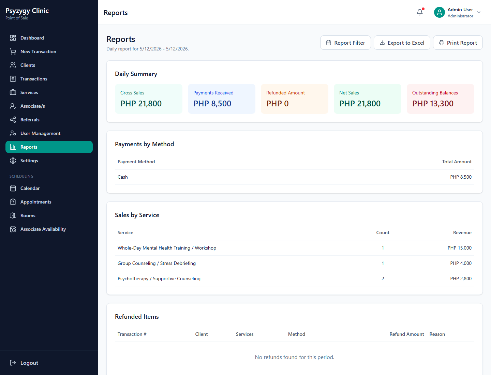

Use **Reports** to review clinic sales and operational summaries.

Common tasks:

1. Select the report period.
2. Choose daily, weekly, monthly, or yearly filters.
3. Review paid, unpaid, refunded, and voided items.
4. Export or print reports when needed.

Reports should be reviewed before end-of-day reconciliation.

## Settings

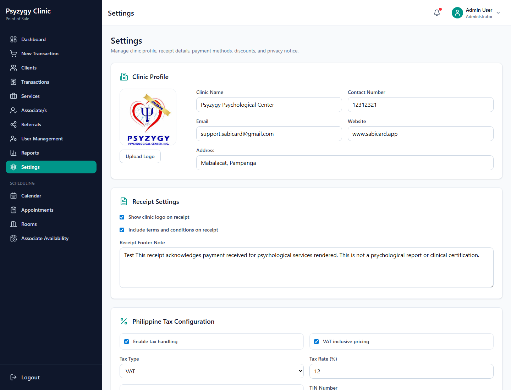

Use **Settings** to manage clinic profile, receipt, privacy, payment, discount, and tax configuration.

Common settings:

1. Clinic name, address, contact number, and email.
2. Logo used on login and receipts.
3. Receipt footer.
4. Payment methods.
5. Discount types.
6. VAT or NON-VAT configuration.
7. TIN and BIR registration details.
8. Privacy notice.

Important:

- Changes to tax settings affect future transaction calculations and receipts.
- Confirm VAT/NON-VAT settings with clinic management before changing them.

## Daily Front Desk Checklist

Start of day:

1. Log in with your own account.
2. Check the dashboard.
3. Review the appointment calendar.
4. Confirm rooms and associate availability for the day.

During operations:

1. Search for the client before creating a new client record.
2. Create appointments before payment when scheduling first.
3. Convert appointments to POS transactions when payment is ready.
4. Select the correct service, associate, referral, discount, and payment method.
5. Review VAT or NON-VAT display before saving.
6. Print receipts after payment is recorded.

End of day:

1. Review transactions.
2. Check unpaid and partial balances.
3. Review refunds and voided transactions.
4. Export or print reports if required.
5. Log out before leaving the workstation.

